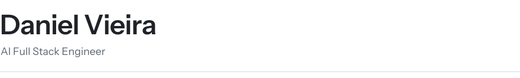

<picture>
  <source media="(prefers-color-scheme: dark)" srcset=".github/assets/header-dark.svg" />
  
</picture>

  

**English** · [Português](README.pt-BR.md)

 

> The gap between an agent that demos well and one that actually runs has a name: **the harness** — the policies, the hooks, the guardrails and the evaluation suite around the model.
> Full stack is not my title. It is why I can take an agent from prototype to production without waiting on anyone else.

 

### Impact

<table>
<tr>
<td width="33%" valign="top">

## −99.3%

**cost per query**

US$ 6.00 → US$ 0.04. A 600k-token catalogue in every prompt, replaced by RAG over a vector database. Same daily budget: **3 → 500 customers/day**.

</td>
<td width="33%" valign="top">

## +92%

**completed bookings**

~120 → ~230 per month. Exam scheduling for a large hospital, moved from n8n to an agent in code with a closed harness around the model.

</td>
<td width="33%" valign="top">

## −80%

**engineering cycle**

From scope to a live bot. A Figma plugin turns the prototype into structured JSON, and the App Builder turns that JSON into a production bot.

</td>
</tr>
</table>

The last two run on Smartspace's private code. The first one is open at <a href="https://github.com/dv-dev1/n8n-rag-catalog-optimizer">n8n-rag-catalog-optimizer</a>, with the before and the after.

 

### Stack

**AI**

**Backend & frontend**

**Data & infrastructure**

 

### Currently

Conversational AI Engineer and Full Stack Developer at **Smartspace**, building LLM agents in production and the applications around them — from the flow to the deploy.

Also standardising the team's AI-assisted development with a workspace of hooks and skills, so LLM generation follows the architectural pattern by construction instead of by case-by-case correction.

**Open to AI Engineer and Automation Engineering roles.** Remote from Brazil, and happy to relocate to São Paulo when a role calls for it.

 

